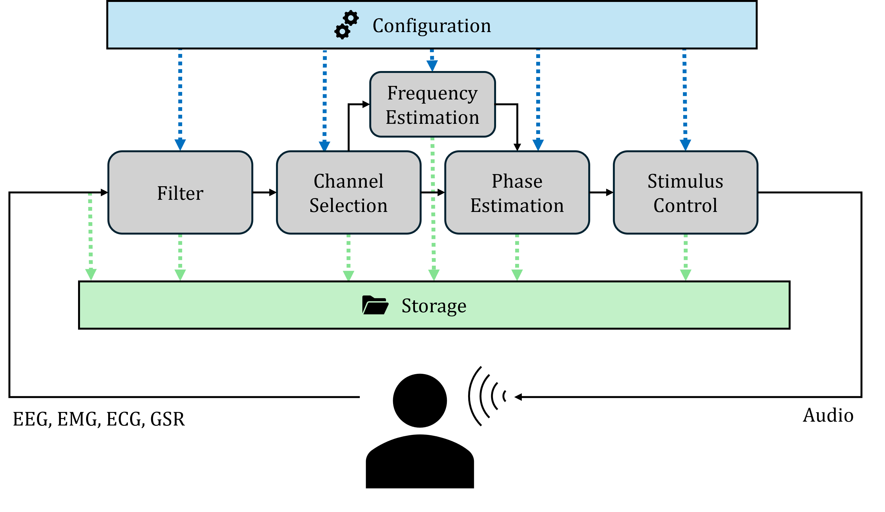

# CLAS - Closed-Loop Auditory Stimulation

This repository contains two related but distinct things:

1. **CLAS core** — a closed-loop auditory stimulation system (CLAS) built on **Falcon** (https://github.com/falcon-eyrie/falcon-core, moved to https://github.com/falcon-neuro/falcon on Sep 17, 2026), a real-time processing-graph engine. This is the actual experiment/recording pipeline
2. **Side analysis / research** — standalone explorations of signal-processing algorithms that CLAS uses or could use (alpha-frequency estimation, phase estimation, sliding-DFT, TurboLink hardware latency), kept alongside the core system but developed and run independently of it.


## Table of contents

- [Repository structure](#repository-structure)
  - [CLAS core (Falcon)](#clas-core-falcon)
  - [Side analysis / research](#side-analysis--research)
- [Installation](#installation)
  - [Install requirements](#install-requirements)
  - [FFTW Installation](#fftw-installation)
  - [Isolate CPU cores](#isolate-cpu-cores)
- [Configuration](#configuration)
  - [Configuring a graph (YAML)](#configuring-a-graph-yaml)
- [Execution](#execution)
  - [Running a graph](#running-a-graph)
    - [Using clas.py (recommended for experiments)](#using-claspy-recommended-for-experiments)
    - [Using the GUI directly (simple_client)](#using-the-gui-directly-simple_client)
  - [Simulate a UDP sender (z_extra/simulate_EEG.py)](#simulate-a-udp-sender-z_extrasimulate_eegpy)
  - [Offline analysis (analysis/)](#offline-analysis-analysis)
  - [Generate Flowchart of graph](#generate-flowchart-of-graph)
- [Troubleshooting](#troubleshooting)
  - [Restoring audio after Falcon takes over the sound card](#restoring-audio-after-falcon-takes-over-the-sound-card)
  - [Connection of TurboLink via an USB Ethernet adapter](#connection-of-turbolink-via-an-usb-ethernet-adapter)

## Repository structure

### CLAS core (Falcon)

- [**`falcon/`**](falcon/) — vendored Falcon engine source.
- [**`extensions/processors/`**](extensions/processors/) — this project's custom Falcon processors (e.g. [`PhaseEstimation`](extensions/processors/PhaseEstimation/), [`FrequencyEstimation`](extensions/processors/FrequencyEstimation/), [`StimControl`](extensions/processors/StimControl/), [`UDPSource`](extensions/processors/UDPSource/), [`MultiChannelFilter`](extensions/processors/multichannelfilter/)); each has its own `doc.yaml` documenting its ports and parameters.
- [**`resources/`**](resources/) — shared assets used by processors and graphs: [**`graphs/`**](resources/graphs/) holds the Falcon graph YAMLs that wire processors together into a pipeline, [**`filters/`**](resources/filters/) and [**`fft_wisdom/`**](resources/fft_wisdom/) hold precomputed filter coefficients and cached FFTW wisdom that processors load at startup, and [**`sounds/`**](resources/sounds/) holds the auditory stimuli (wav files) played during stimulation.
- [**`analysis/`**](analysis/) — the shared Python package that `clas.py` runs automatically after a recording finishes to score/plot the result; also runnable standalone. See [analysis/README.md](analysis/README.md).
- [**`lib/`**](lib/) — vendored C++ dependencies used by Falcon/extensions.
- [**`clas.py`**](clas.py) — main entry point: drives Falcon end-to-end for a recording (see "Running a graph" below).
- [**`sweep_clas.py`**](sweep_clas.py) — runs `clas.py` across a sweep of parameters/graphs.
- [**`plot_processor_flowchart.py`**](plot_processor_flowchart.py) — renders a Falcon graph yaml as a flowchart.
- [**`stim_protocol.csv`**](stim_protocol.csv) — example stimulation on/off schedule for `clas.py`.
- [**`results/`**](results/) — timestamped output directories from `clas.py` runs.

### Side analysis / research

- **`IAF_Estimation/`** — comparisons of algorithms for estimating individual alpha frequency, plus the `cecHT` calibrated end-corrected Hilbert transform reference implementation as a git submodule.
- **`SlidingDFT/`** — a vendored sliding-DFT library with its own error-growth benchmarks, used to evaluate this technique as an alternative to the FFTW used in CLAS core. See [SlidingDFT/Readme.md](SlidingDFT/Readme.md).
- **`PHASE_estimation/`** — exploration of phase-estimation approaches (JADE, extended Hilbert transform) package and evaluation for different kind of pre-filter.
- **`TurbolinkMeas/`** — standalone tooling to measure TurboLink packet timing/jitter. See [TurbolinkMeas/meas.md](TurbolinkMeas/meas.md).

## Installation

### Install requirements
```bash
pip install -r requirements.txt
sudo apt-get install libzmq3-dev
sudo apt install libboost-dev    # for boost ringbuffer support
sudo apt install libasound2-dev  # ALSA headers, needed to link StimControl's audio output
sudo apt install gcc-14 g++-14

mkdir build

cmake -B build/debug -DCMAKE_BUILD_TYPE=Debug -DCMAKE_C_COMPILER=gcc-14 -DCMAKE_CXX_COMPILER=g++-14
cmake --build build/debug -- -j$(nproc) 

# or for release:
cmake -B build/release -DCMAKE_BUILD_TYPE=Release -DCMAKE_C_COMPILER=gcc-14 -DCMAKE_CXX_COMPILER=g++-14
cmake --build build/release -- -j$(nproc)

# Add the installation path in your $PATH if not already the case
export PATH="$PWD/build/release/falcon:$PATH"

# Check if installation worked
falcon --help
```

### FFTW Installation

[`FrequencyEstimation`](extensions/processors/FrequencyEstimation/) and
[`PhaseEstimation`](extensions/processors/PhaseEstimation/) both link `fftw3` directly (see their
[`CMakeLists.txt`](extensions/processors/FrequencyEstimation/CMakeLists.txt)) for their
real-time FFTs, using only FFTW's double-precision API. Download and install it system-wide so
the plain `-lfftw3` link name resolves:

```bash
wget https://www.fftw.org/fftw-3.3.10.tar.gz
tar xzf fftw-3.3.10.tar.gz          # extracts to fftw-3.3.10/ (gitignored) at the repo root
cd fftw-3.3.10

./configure --enable-sse2 --enable-avx --enable-avx2 CFLAGS="-O3 -march=native -mtune=native"
make
sudo make install
```

The SIMD flags (`--enable-sse2/avx/avx2`) and `-march=native` speed up the actual FFT codelets
FFTW uses.

FFTW plans are cached as "wisdom" under [`resources/fft_wisdom/`](resources/fft_wisdom/): both
processors try `FFTW_WISDOM_ONLY` first and fall back to the much slower `FFTW_PATIENT` planning
mode (logged as a warning) when the FFT size hasn't been planned before, writing the result back
to [`fftw_wisdom.txt`](resources/fft_wisdom/fftw_wisdom.txt) on shutdown so the next run with the
same size starts up fast. Wisdom for the sizes both processors use
can also be precomputed ahead of time with
[`z_extra/precompute_wisdom.cpp`](z_extra/precompute_wisdom.cpp) (build with `g++ -O2 -o
z_extra/precompute_wisdom z_extra/precompute_wisdom.cpp -lfftw3`, then run from the repo root).

### Isolate CPU cores

Isolate cores for Falcon's pinned threads, so the general scheduler, the periodic
scheduling-tick interrupt, RCU callback processing, and hardware IRQs all stay off them. Add to
`GRUB_CMDLINE_LINUX_DEFAULT` in `/etc/default/grub`:
```
isolcpus=5-11,17-23 nohz_full=5-11,17-23 rcu_nocbs=5-11,17-23 irqaffinity=0-4,12-16
```
then apply and reboot:
```bash
sudo update-grub
sudo reboot
```
The core numbers above are specific to the machine this was tuned on (a 12-core/24-thread CPU,
isolating one hyperthread sibling pair per physical core) -- check your own topology with
`lscpu -e` and `cat /sys/devices/system/cpu/cpu*/topology/thread_siblings_list` before reusing
them, and make sure every `thread_core` value used in the graphs you actually run falls inside
the isolated set (`isolcpus`/`nohz_full`/`rcu_nocbs`), while `irqaffinity` covers the
*non*-isolated cores. After rebooting, confirm the isolated cores took effect with
`cat /proc/cmdline`.

## Configuration

### Configuring a graph (YAML)

A graph file under [`resources/graphs/`](resources/graphs/) (e.g.
[`SimulateCLAS.yaml`](resources/graphs/SimulateCLAS.yaml)) describes the whole processing
pipeline. Top-level keys under `graph:`:

- **`name`** — the graph's name, used e.g. in log messages.
- **`defaults`** — YAML anchors (`&name`) for values shared across processors (sample rate,
  `n_messages`, thread priority, ...), referenced elsewhere with `*name` so they only need to
  be changed in one place.
- **`processors`** — one entry per node in the pipeline, keyed by the *instance name* you
  choose (e.g. `ecHTFilter`), not the class name:
  - **`class`** — which processor implementation to instantiate (a subfolder under
    [`extensions/processors/`](extensions/processors/), e.g.
    [`MultiChannelFilter`](extensions/processors/multichannelfilter/)).
  - **`options`** — the processor's configurable parameters. Every processor documents its own
    options (name, type, default, meaning) in its `extensions/processors/<Class>/doc.yaml` --
    that file is the source of truth for what can go here, not this README.
  - **`advanced`** — engine-level tuning, not the processor's own logic: `buffer_sizes` (ring
    buffer capacity per output port), `thread_core` (CPU core(s) to pin the processor's
    thread(s) to), `threadpriority` (real-time scheduling priority).
  - A processor name followed by `(1-5)` (e.g. `Serializer(1-5)`) expands into that many
    numbered instances (`Serializer1` .. `Serializer5`) of the same class/options, useful for
    wiring several independent output streams to their own file/socket serializer.
- **`connections`** — wires an output port/slot to an input port: `Proc.port.slot = Proc2.in`.
  A port with no explicit `.slot` connects slot 0. Multiple connections into the same input
  port fan data from several sources into it.
- **`states`** — shared state wiring between processors (Falcon's follower/broadcaster
  mechanism, e.g. one processor broadcasting an estimated `f0` that others follow); the
  processor-side end of each named state (`FrequencyEstimation.f0`, etc.) is documented in that
  processor's `doc.yaml` under "Shared state".

To adapt an existing graph (e.g. for a new experiment), copy one under
[`resources/graphs/`](resources/graphs/), change `options`/`connections` as needed, and point
`clas.py --graph` at the new file. Use
[`plot_processor_flowchart.py`](plot_processor_flowchart.py) (see below) to sanity-check the
wiring visually.

## Execution

### Running a graph

There are two ways to run a graph: through [`clas.py`](clas.py), which drives Falcon end-to-end
for actual recordings/experiments, or by starting Falcon yourself and controlling it through the
`simple_client` GUI, which is faster for quickly testing or debugging a graph.

#### Using clas.py (recommended for experiments)
```bash
python3 clas.py --graph SimulateCLAS.yaml --results_dir my_experiment
```
`clas.py` wraps the raw Falcon server and adds everything an actual run needs that the GUI does
not do for you:
- precomputes and caches filter coefficients (`MultiChannelFilter`/`PhaseEstimation`) before
  starting Falcon, so processors never fail to find a coefficient file
- creates a timestamped results directory and copies the graph file (and stim protocol, if used)
  into it for record-keeping
- can drive an automated stimulation protocol (`--stim_protocol`) on its own thread
- runs post-processing analysis (`analyse_results`) automatically once the graph stops
- gives you a simple keyboard interface while running: `s` stop, `r` restart (new results dir),
  `z` start the stim protocol early, `q` quit

#### Using the GUI directly (simple_client)
Useful for quickly loading/inspecting a graph, watching live states, or poking at a running graph without going through the full `clas.py` pipeline. Note that the GUI does **not** do any of the pre-flight steps above (no filter precompute, no results-dir bookkeeping, no stim
protocol automation, no post-run analysis) — it only talks to an already-running Falcon server.

Requires:
- the `falcon_clients` package (not on PyPI — clone and install it separately):
  ```bash
  git clone https://bitbucket.org/kloostermannerflab/falcon-client.git
  pip install -e falcon-client
  ```
- `PyQt5`, which the GUI imports but which `falcon_clients` does not declare as a dependency:
  ```bash
  pip install PyQt5
  ```

Usage:
1. Start Falcon with [this project's config](.falcon/config.yaml):
   ```bash
   falcon --config .falcon/config.yaml
   ```
2. In a second terminal, start the GUI:
   ```bash
   simple_client
   ```
3. In the GUI, use **Upload Graph** (paste/load a local `.yaml` file's contents) or **Build
   Remote Graph** to load a graph, then use the Start/Stop/
   Quit controls.

### Simulate a UDP sender (z_extra/simulate_EEG.py)
[`z_extra/simulate_EEG.py`](z_extra/simulate_EEG.py) sends synthetic EEG packets over UDP to a
running `UDPSource` processor node (port 25000) and, on exit (Ctrl-C), writes the exact signal
it sent to `simulated_signal.npy` in the current directory.
[`analysis/main.py`](analysis/main.py) uses this file as ground truth when scoring a recording
against the true phase/frequency.

Start it only *after* Falcon is already running in a second terminal/process:
```bash
python3 clas.py --graph TurboLinkCLAS.yaml               # terminal 1
python3 z_extra/simulate_EEG.py                          # terminal 2, once Falcon is ready
```
`UDPSource` discards the first `calib_packets` packets it receives for start-time calibration
before publishing anything (see the `calib_packets` option in the graph yaml). If the client is
started before `UDPSource` has bound its socket, those early packets are silently dropped by the
OS instead of counted as calibration packets, and the ground-truth alignment in
[`analysis/main.py`](analysis/main.py) (which skips exactly `calib_packets` rows of
`simulated_signal.npy`) will be off by however many were lost.

### Offline analysis (analysis/)

`clas.py` runs a full analysis automatically after a recording finishes, but the
[`analysis/`](analysis/) package can also be run standalone against any `results/` folder.
See [analysis/README.md](analysis/README.md) for the CLI entry points and package layout.

### Generate Flowchart of graph
```bash
python3 plot_processor_flowchart.py resources/graphs/SimulateCLAS.yaml
```

## Troubleshooting

### Restoring audio after Falcon takes over the sound card
The program taking over the sound card can leave normal audio broken afterwards. Restart Pipewire to restore it:
```bash
systemctl --user restart pipewire.service
```

### Connection of TurboLink via an USB Ethernet adapter
- Symptom: samples arrive in bursts rather than with the nominal inter-sample interval (you can check this by executing the script [measurement.cpp](TurbolinkMeas/measurement.cpp) followed by [plotMeas.py](TurbolinkMeas/plotMeas.py) -> the PDV histogram shall show a single uniform distribution instead of having multiple maxima)
- Cause: USB Ethernet adapters (interface names like `enx<mac>`) can have NIC interrupt coalescing (`rx-usecs`) set very high by default, so incoming packets are batched and delivered to the kernel/app in bursts instead of individually.
- Check current setting (replace `<iface>` with your adapter, e.g. from `ip -brief link show`):
```bash
sudo ethtool -c <iface>
```
- Fix (not persistent, resets on reboot/replug):
```bash
sudo ethtool -C <iface> rx-usecs 0
```
- Make it persistent by adding a udev rule that reapplies the setting whenever the adapter is connected (the `enx<mac>` name is stable per device):
```bash
# /etc/udev/rules.d/71-usb-eth-coalesce.rules
ACTION=="add", SUBSYSTEM=="net", KERNEL=="<iface>", RUN+="/usr/sbin/ethtool -C %k rx-usecs 0"
```
```bash
sudo udevadm control --reload-rules
```
- Note: some USB Ethernet drivers don't actually implement coalescing and may silently ignore the setting — re-run `ethtool -c <iface>` after setting it to confirm the value changed.
